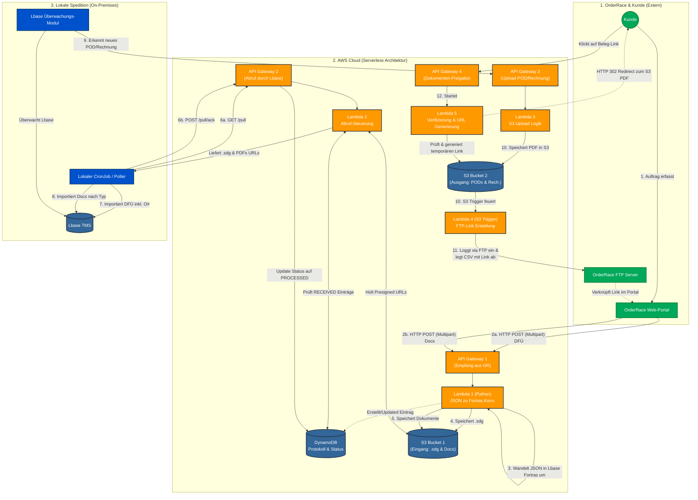

# Architektur-Dokumentation: OrderRace Lbase Integration

## Übersicht

Die vorliegende Architektur realisiert die Anbindung des externen OrderRace Web-Portals an das lokale Lbase TMS der Spedition über eine Serverless-Zwischenschicht in der AWS Cloud. Dadurch können Aufträge sicher empfangen, konvertiert und an Lbase übergeben werden. Im Gegenzug können aus Lbase stammende Dokumente (PODs, Rechnungen) an OrderRace zurückgespielt werden.

## Architektur-Diagramm

Das folgende Diagramm veranschaulicht den Datenfluss über die drei Zonen:
1. Externes OrderRace Portal & Kunden
2. AWS Serverless Cloud
3. Lokales Speditions-Netzwerk (On-Premises)

## Ablauf-Beschreibung

### 1. Ingestion (Eingang - Multipart & Asynchron)
Sobald ein Kunde einen Auftrag im Portal erfasst, pusht der OrderRace Daemon separate HTTP POST (multipart/form-data) Requests an das zentrale API Gateway (`/ingest`). Der Query-Parameter `typ` steuert die Verarbeitung:
- **`typ=dfue`**: Auftrags-DFÜ mit Multi-Order-Support. Pro Auftrag in `orders[]` wird eine eigene `.sdg`-Datei erzeugt und ein DynamoDB-Eintrag angelegt.
- **`typ=audit`**: Audit-Update/Korrektur. Erzeugt versionierte Dateien (`sdg/{onum}_v{N}.sdg`) mit automatisch inkrementierter `AuditVersion` in DynamoDB.
- **`typ=orderauto`**: OrderAuto-Daten werden ohne Konvertierung als rohe JSON in S3 unter `orderauto/` gespeichert.
- **`typ=document`**: Nur Dokumente (PDF). Die `onum` wird aus dem strukturierten Dateinamen gelesen.

Die Lambda-Funktion `lambda_conv` parst den Multipart-Payload, routet anhand des `typ`-Parameters und legt die Dateien im `IngestBucket` ab. Ein Eintrag in DynamoDB (`FilesToDownload`) wird erstellt oder erweitert.

### 2. Polling (Abruf nach Lokal & Acknowledge)
Ein lokaler CronJob in der Spedition fragt in regelmäßigen Abständen den API-Endpunkt `/pull` ab. Die Funktion `lambda_pull` liefert für alle Datensätze mit Status `RECEIVED` Presigned-URLs für den direkten S3-Download. Nach erfolgreichem Download ins lokale Netz ruft der CronJob den Endpunkt `/pull/ack` auf. Die Funktion `lambda_pull_ack` markiert diese Bestellungen in DynamoDB als `PROCESSED`, um ein erneutes Herunterladen zu verhindern.

### 3. Egress (Ausgang)
Sobald im Lbase neue Status-Updates oder Dokumente (z.B. POD/Rechnung) verfügbar sind, werden sie per API-Aufruf an `/upload` übergeben. `lambda_upload` speichert die PDF-Datei im `EgressBucket`. Ein Event-Trigger startet daraufhin `lambda_ftp`, welche eine CSV-Datei mit Verlinkungen auf dem OrderRace-FTP-Server ablegt.

### 4. Serve (Freigabe)
Klickt ein Kunde in OrderRace auf den von der FTP-Rückmeldung erzeugten Link, ruft dies den `/serve/{document_id}` Endpunkt auf. Die Funktion `lambda_serve` prüft kurz die Gültigkeit, generiert einen temporären S3-Download-Link und führt einen HTTP 302 Redirect direkt zur PDF-Datei im Browser des Kunden aus.

### 5. Admin Dashboard & Monitoring

Das System verfuegt ueber ein geschuetztes Admin-Dashboard:

- **Hosting**: Statische SPA in S3, ausgeliefert ueber CloudFront (HTTPS)
- **Authentifizierung**: AWS Cognito User Pool (kein Self-Sign-Up, nur Admin-erstellte Accounts)
- **Admin API**: `lambda_admin` bedient `/admin/api/*`-Routen mit Cognito-Authorizer
- **Event-Logging**: Alle Lambda-Funktionen schreiben strukturierte Events in eine `EventLogTable` (DynamoDB mit TTL)
- **Fehler-Benachrichtigungen**: CloudWatch Alarms auf alle 7 Lambda-Funktionen, bei Fehlern Benachrichtigung per SNS (E-Mail)

**Dashboard-Bereiche:**
- Uebersicht mit Statistiken (Auftraege gesamt, heute, nach Typ, Fehlerquote)
- Auftragslistee mit Status-Anzeige (Offen / Teilweise / Abgeholt)
- Auftrags-Detail mit Dateistatus und Event-Verlauf
- Event-Log und Fehler-Log
- CloudWatch-Metriken (API-Aufrufe, Latenz, Fehler pro Lambda)
